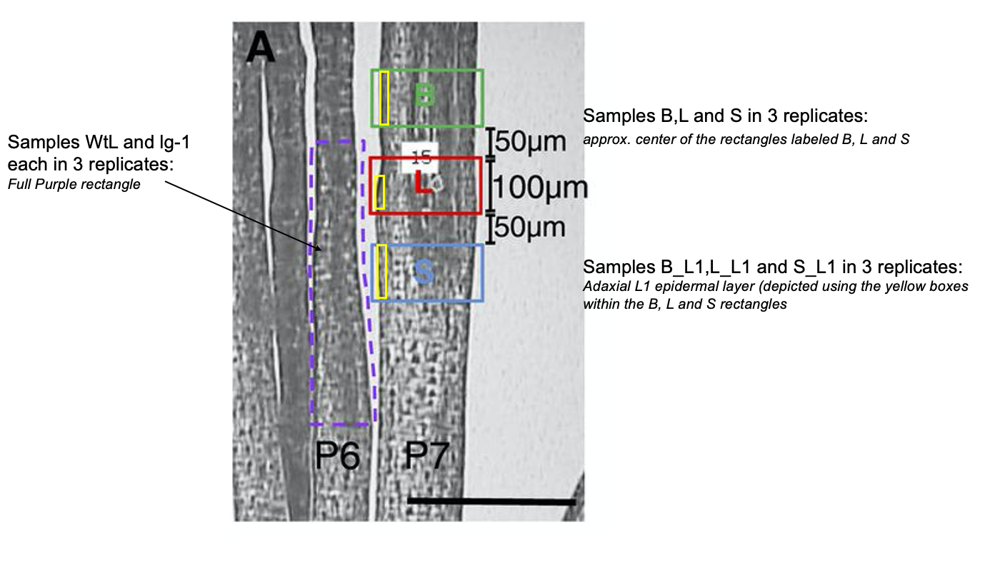

# All important metadata related to the project and files in 00_Files.md

## Bumble Bee
|Well_ID|	Sample_Name|	Trt|	Nest|
|A01|	A1|	ctrl|	1|
|A02|	A2|	ctrl|	1|
|A03|	A3|	ctrl|	1|
|A04|	A4|	ctrl|	1|
|A05|	A5|	ctrl|	1|
|A06|	A6|	ctrl|	1|
|A07|	A7|	ctrl|	1|
|A08|	A8|	ctrl|	1|
|A09|	A9|	ctrl|	1|
|A10|	A10|	ctrl|	1|
|A11|	A11	|ctrl|	1|
|A12|	A12|	ctrl|	1|
|B01|	A13|	ctrl|	1|
|B02|	A14	|ctrl|	1|
|B03|	A16|	ctrl|	1|
|B04|	A17|	ctrl|	1|
|B05|	A18|	ctrl|	1|
|B06|	A19|	ctrl|	1|
|B07|	B2|	exposed|	2|
|B08|	B3|	exposed|	2|
|B09|	B4|	exposed|	2|
|B10|	B5|	exposed|	2|
|B11|	B6|	exposed|	2|
|B12|	B7|	exposed|	2|
|C01|	B8|	exposed|	2|
|C02|	B10|	exposed|	2|
|C03|	C1|	ctrl|	3|
|C04|	C2|	ctrl|	3|
|C05|	C3|	ctrl|	3|
|C06|	C4|	ctrl|	3|
|C07|	C6|	ctrl|	3|
|C08|	C7|	ctrl|	3|
|C09|	C8|	ctrl|	3|
|C10|	C9|	ctrl|	3|
|C11|	D1|	exposed|	4|
|C12|	D2|	exposed|	4|
|D01|	D5|	exposed|	4|
|D02|	D6|	exposed|	4|
|D03|	D7|	exposed|	4|
|D04|	D8|	exposed|	4|
|D05|	D9|	exposed|	4|
|D06|	D10|	exposed|	4|
|D07|	D11	|exposed|	4|
|D08|	E1|	exposed|	5|
|D09|	E2|	exposed|	5|
|D10|	E5|	exposed|	5|
|D11|	E7|	exposed|	5|
|D12|	E8|	exposed|	5|
|E01|	E9|	exposed|	5|
|E02|	E10|	exposed|	5|
|E03|	F1	|exposed|	6|
|E04|	F2|	exposed|	6|
|E05|	F3|	exposed|	6|
|E06|	F4|	exposed|	6|
|E07|	F5|	exposed|	6|
|E08|	F6|	exposed|	6|
|E09|	F7|	exposed|	6|
|E10|	F8|	exposed|	6|
|E11|	F9|	exposed|	6|
|E12|	F10|	exposed|	6|

## Maize Dataset:
[Bioproject: PRJNA260793](https://www.ebi.ac.uk/ena/browser/view/PRJNA260793)

[Associated Publication: Johnston et al., 2014](http://www.plantcell.org/content/26/12/4718)

* The maize leaf is an ideal system to study plant morphogenesis
* It is divided into a proximal (close to stem) sheath and a distal blade each with distinct developmental patterning.
* Specialized epidermal fringe ligule and auricle structures form at the blade-sheath boundary.

For full metadata: see the NCBI GEO page for [GSE61333](GSE61333)

The SRX vs sample relation is given here broadly captured from the full metadata file:

|Sample_relation|SRR_ID    |Maize_cultivar|Genotype |Sample_description                                                 |Sample_title|
|---------------|----------|--------------|---------|-------------------------------------------------------------------|------------|
|SRX699505      |SRR1573504|B73           |wild-type|all cell layers Leaf blade; Repeat:3                               |B-3         |
|SRX699506      |SRR1573505|B73           |wild-type|all cell layers Leaf blade; Repeat:4                               |B-4         |
|SRX699507      |SRR1573506|B73           |wild-type|all cell layers Leaf blade; Repeat:5                               |B-5         |
|SRX699508      |SRR1573507|B73           |wild-type|all cell layers Leaf ligule; Repeat:3                              |L-3         |
|SRX699509      |SRR1573508|B73           |wild-type|all cell layers Leaf ligule; Repeat:4                              |L-4         |
|SRX699510      |SRR1573509|B73           |wild-type|all cell layers Leaf ligule; Repeat:5                              |L-5         |
|SRX699511      |SRR1573510|B73           |wild-type|all cell layers Leaf sheath; Repeat:3                              |S-3         |
|SRX699512      |SRR1573511|B73           |wild-type|all cell layers Leaf sheath; Repeat:4                              |S-4         |
|SRX699513      |SRR1573512|B73           |wild-type|all cell layers Leaf sheath; Repeat:5                              |S-5         |
|SRX699514      |SRR1573513|B73           |wild-type|Wild-type tissue from P6 leaf primordia all cell layers. Repeat 1 |wtL-1       |
|SRX699515      |SRR1573514|B73           |wild-type|Wild-type tissue from P6 leaf primordia all cell layers. Repeat 2 |wtL-2       |
|SRX699516      |SRR1573515|B73           |wild-type|Wild-type tissue from P6 leaf primordia all cell layers. Repeat 3 |wtL-3       |
|SRX699517      |SRR1573516|B73           |lg1-R    |lg1 mutant tissue from P6 leaf primordia all cell layers. Repeat 1|lg1-1       |
|SRX699518      |SRR1573517|B73           |lg1-R    |lg1 mutant tissue from P6 leaf primordia all cell layers. Repeat 2|lg1-2       |
|SRX699519      |SRR1573518|B73           |lg1-R    |lg1 mutant tissue from P6 leaf primordia all cell layers. Repeat 3|lg1-3       |
|SRX699520      |SRR1573519|B73           |wild-type|adaxial L1 tissue was captured. blade; Repeat:1                   |B_L1.1      |
|SRX699521      |SRR1573520|B73           |wild-type|adaxial L1 tissue was captured.  blade; Repeat:2                   |B_L1.2      |
|SRX699522      |SRR1573521|B73           |wild-type|adaxial L1 tissue was captured.  blade; Repeat:3                   |B_L1.3      |
|SRX699523      |SRR1573522|B73           |wild-type|adaxial L1 tissue was captured.  ligule; Repeat:1                  |L_L1.1      |
|SRX699524      |SRR1573523|B73           |wild-type|adaxial L1 tissue was captured.  ligule; Repeat:2                  |L_L1.2      |
|SRX699525      |SRR1573524|B73           |wild-type|adaxial L1 tissue was captured.  ligule; Repeat:3                  |L_L1.3      |
|SRX699526      |SRR1573525|B73           |wild-type|adaxial L1 tissue was captured.  sheath; Repeat:1                  |S_L1.1      |
|SRX699527      |SRR1573526|B73           |wild-type|adaxial L1 tissue was captured.  sheath; Repeat:2                  |S_L1.2      |
|SRX699528      |SRR1573527|B73           |wild-type|adaxial L1 tissue was captured.  sheath; Repeat:3                  |S_L1.3      |

For more details refer to the figure below: This shows how the various tissue samples were microdissected. This is modified from original Fig 2 in [Johnston et al. 2014](http://www.plantcell.org/content/26/12/4718#sec-9),

Reads are unstranded.
