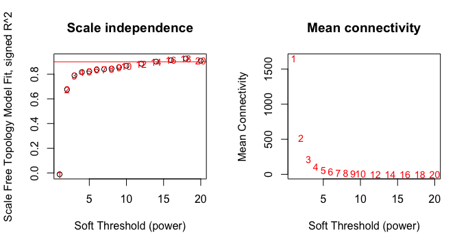
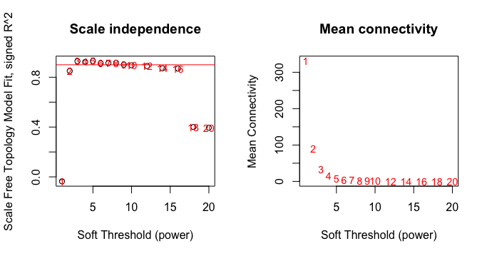
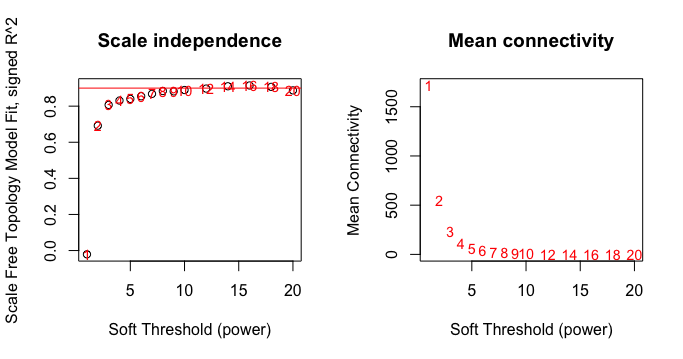
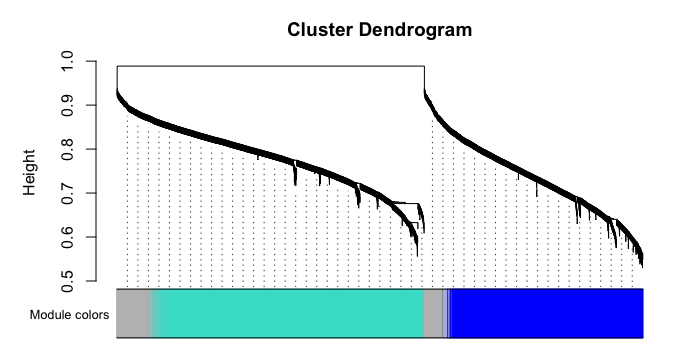
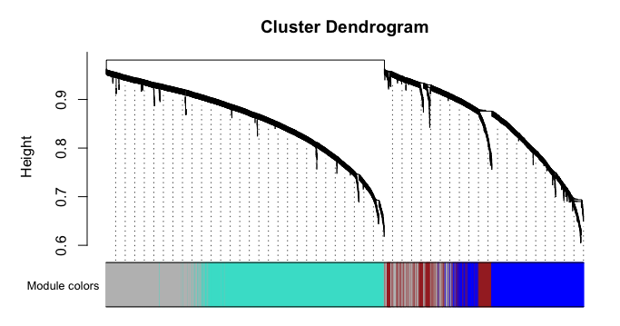
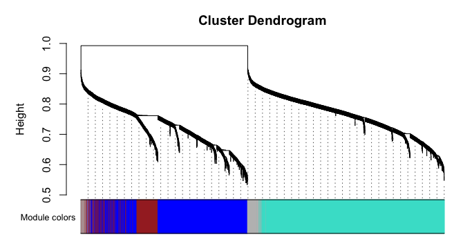
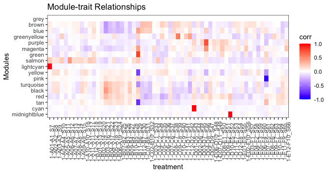
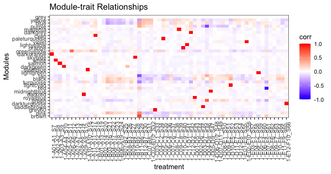
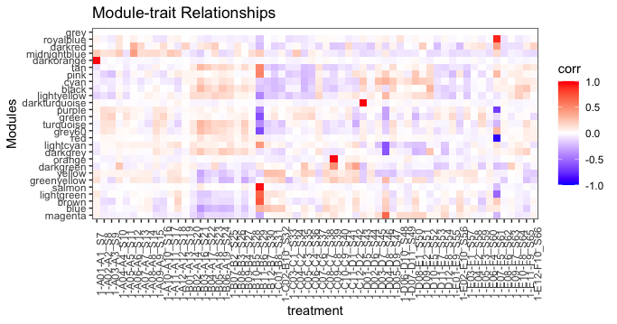

# 05 WGCNA

(1) Load R libraries

```
library(WGCNA)
library(DESeq2)
library(tidyverse)
library(magrittr)
```

(2) Load and normalize data

```
data <- read_excel("gsnap_counts.xlsx", sheet="geneMult")  # gene/mRNA/geneMult   
de_input = as.matrix(data[,-1])
row.names(de_input) = data$Geneid

metadata <- read_excel("gsnap_counts.xlsx", sheet="metadata")
row.names(metadata)=metadata$sample

# === Normalize with DESeq2 for now, can swap this out for a different method
dds <- DESeqDataSetFromMatrix(de_input, colData=metadata, design = ~condition)
dds <- DESeq(dds)
vsd <- varianceStabilizingTransformation(dds)
expr_normalized <- getVarianceStabilizedData(dds)
```

(3) Pick soft-threshold for WGCNA

```
wgcna_input= t(expr_normalized)
allowWGCNAThreads()
powers = c(c(1:10), seq(from=12, to=20, by=2))
sft=pickSoftThreshold(wgcna_input, powerVector=powers, verbose=5)
par(mfrow = c(1,2));
cex1 = 0.9;

plot(sft$fitIndices[, 1],
     -sign(sft$fitIndices[, 3]) * sft$fitIndices[, 2],
     xlab = "Soft Threshold (power)",
     ylab = "Scale Free Topology Model Fit, signed R^2",
     main = paste("Scale independence")
)
text(sft$fitIndices[, 1],
     -sign(sft$fitIndices[, 3]) * sft$fitIndices[, 2],
     labels = powers, cex = cex1, col = "red"
)
abline(h = 0.90, col = "red")
plot(sft$fitIndices[, 1],
     sft$fitIndices[, 5],
     xlab = "Soft Threshold (power)",
     ylab = "Mean Connectivity",
     type = "n",
     main = paste("Mean connectivity")
)
text(sft$fitIndices[, 1],
     sft$fitIndices[, 5],
     labels = powers,
     cex = cex1, col = "red")
```

| <b>gene</b> | <b>mRNA</b> |
|:-:|:-:|
| |  |
|<b>geneMult</b> | |
|||

(4) Run WGCNA

```
picked_power = 6
temp_cor <- cor
cor <- WGCNA::cor
netwk <- blockwiseModules(wgcna_input, power = picked_power, networkType = "signed", 
  deepSplit = 2, pamRespectsDendro = F, minModuleSize = 30, maxBlockSize = 4000, 
  reassignThreshold = 0,  mergeCutHeight = 0.25, saveTOMs = T, saveTOMFileBase = "temp", 
  numericLabels = T, verbose = 3)
mergedColors = labels2colors(netwk$colors)
plotDendroAndColors(
  netwk$dendrograms[[1]],
  mergedColors[netwk$blockGenes[[1]]],
  "Module colors",
  dendroLabels = FALSE,
  hang = 0.03,
  addGuide = TRUE,
  guideHang = 0.05 )
```

| <b>gene</b> | <b>mRNA</b> |
|:-:|:-:|
| |  |
|<b>geneMult</b> | |
|||

(5) Write modules to file

```
module_df <- data.frame( gene_id = names(netwk$colors), colors = labels2colors(netwk$colors))

write_delim(module_df, file = "wgcna_modules_gene.txt", delim = "\t")
```

(6) Relate modules to treatment

```
MEs0 <- moduleEigengenes(wgcna_input, mergedColors)$eigengenes
MEs0 <- orderMEs(MEs0)
module_order = names(MEs0) %>% gsub("ME","", .)
MEs0$treatment = row.names(MEs0)

mME = MEs0 %>%
  pivot_longer(-treatment) %>%
  mutate(
    name = gsub("ME", "", name),
    name = factor(name, levels = module_order)
  )

mME %>% ggplot(., aes(x=treatment, y=name, fill=value)) +
  geom_tile() + theme_bw() +
  scale_fill_gradient2(low = "blue", high = "red", mid = "white",
    midpoint = 0, limit = c(-1,1)) +
  theme(axis.text.x = element_text(angle=90)) +
  labs(title = "Module-trait Relationships", y = "Modules", fill="corr")
```

| <b>gene</b> | <b>mRNA</b>|
|:-:|:-:|
| |  |
|<b>geneMult</b> | |
|||

**(7) Export network**

```
TOM = TOMsimilarityFromExpr(wgcna_input, power = picked_power)
```
