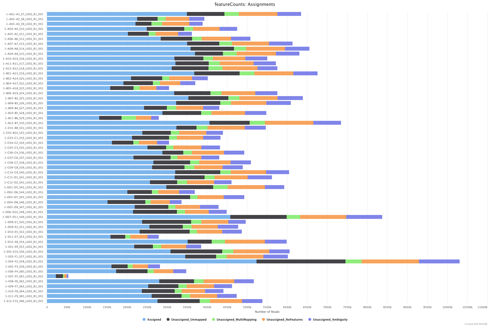
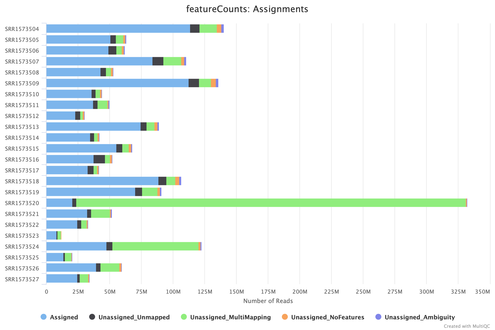
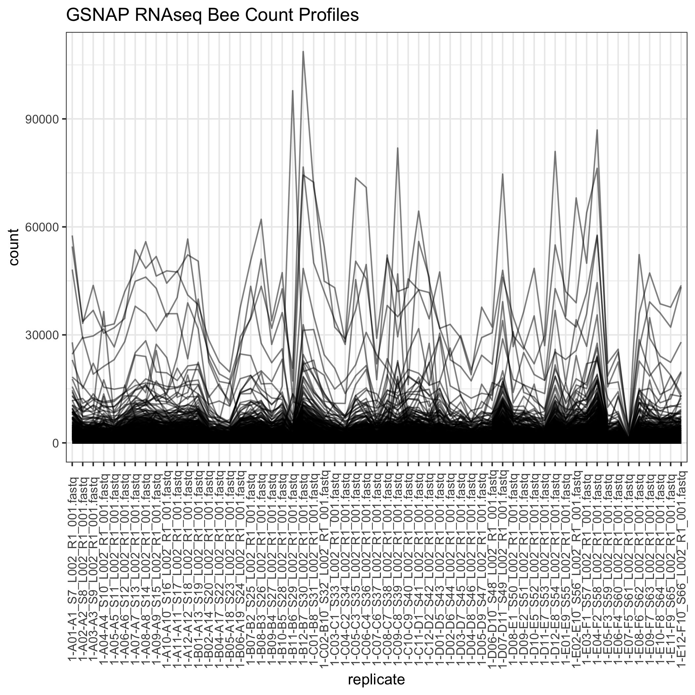
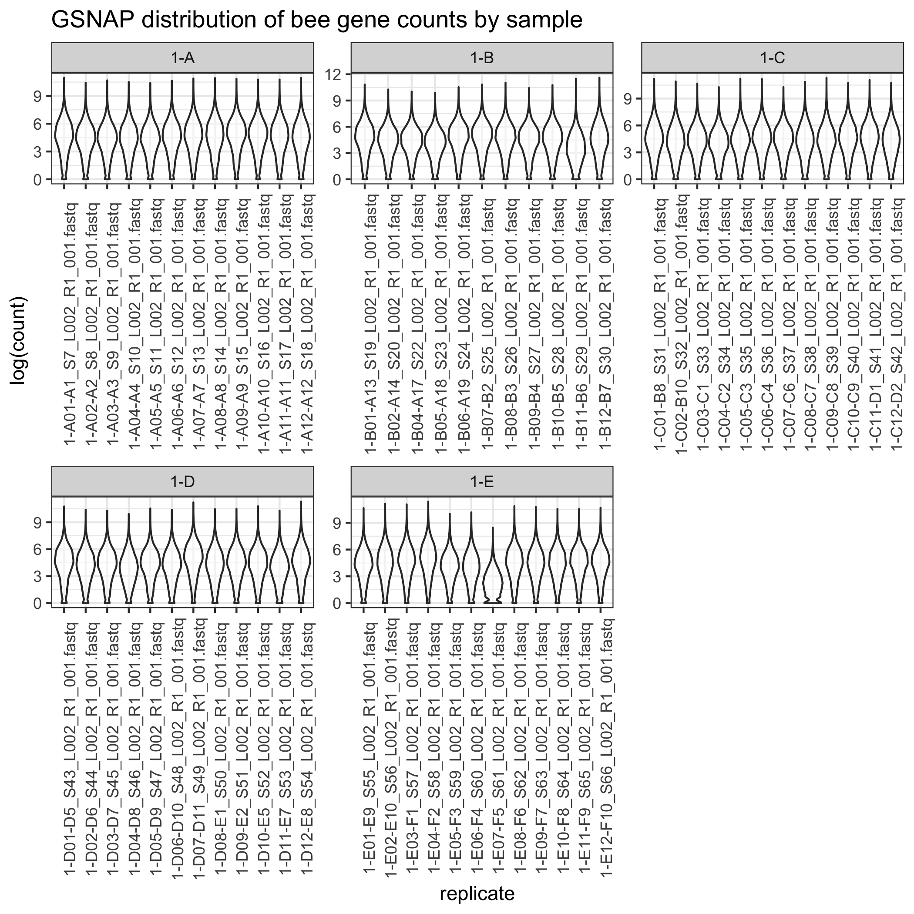
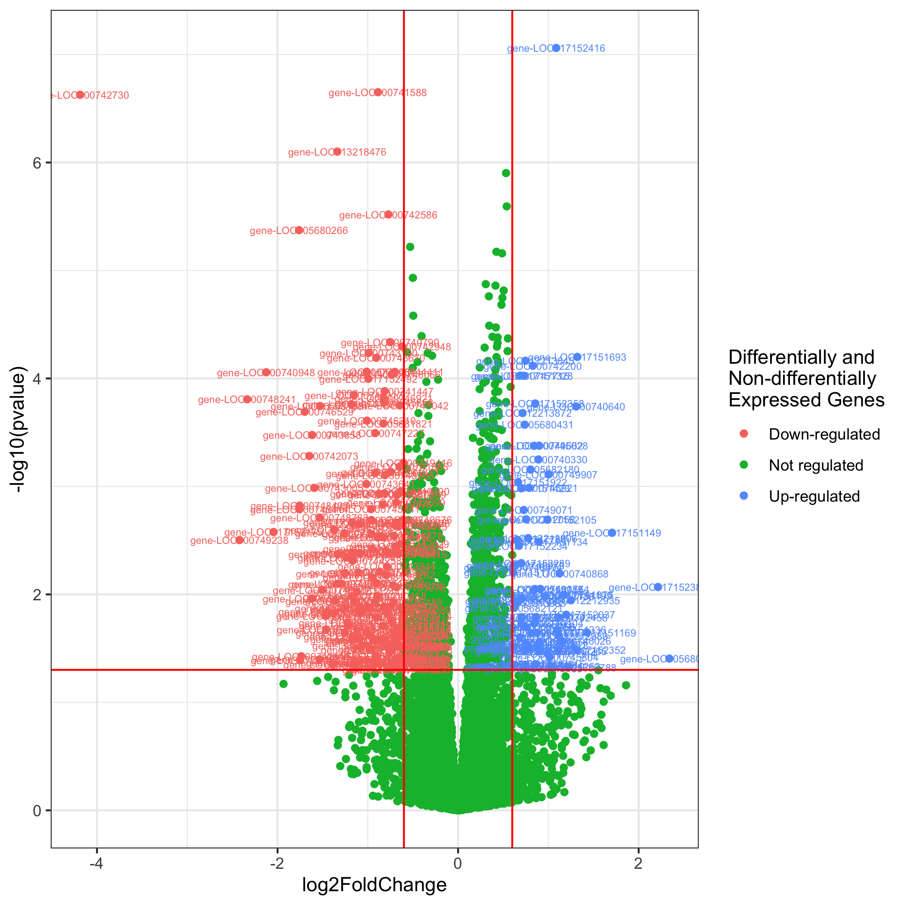
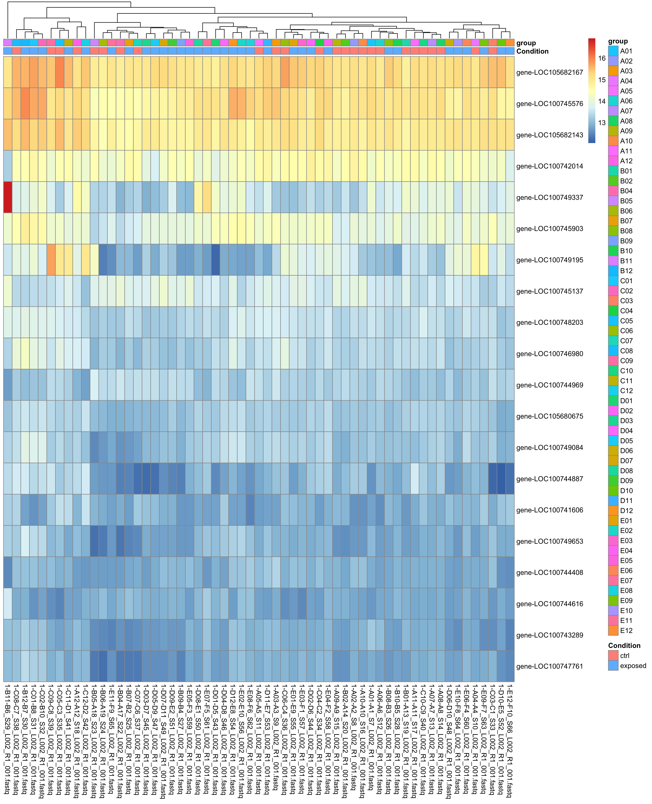
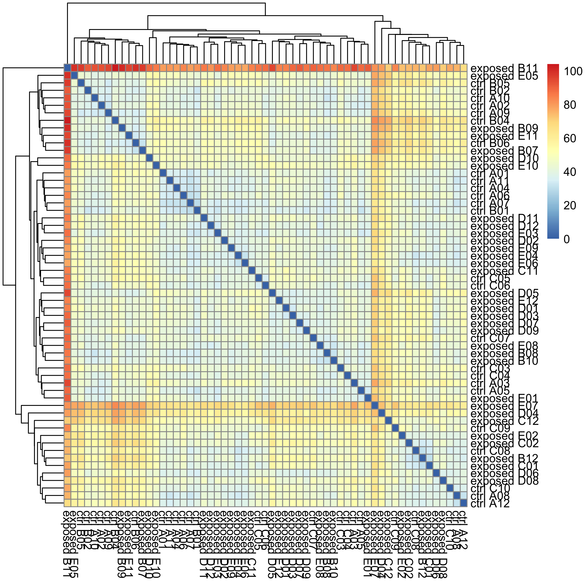
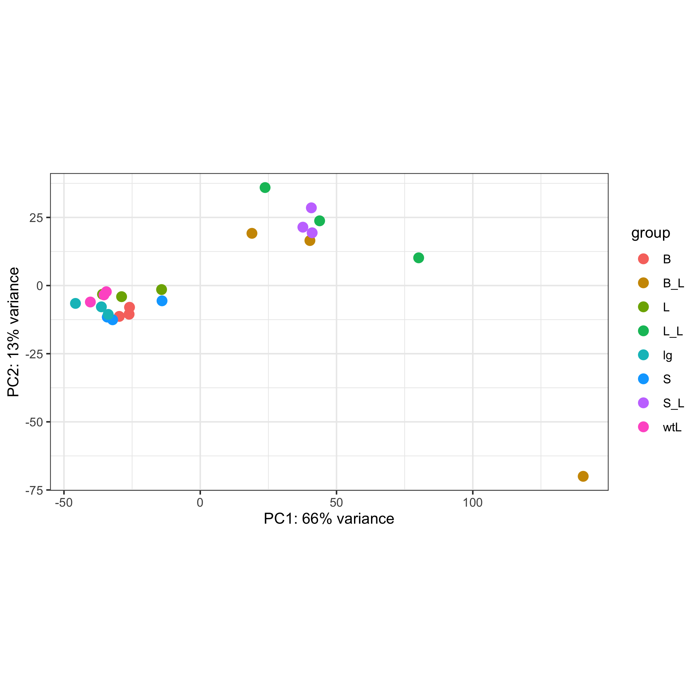

# Methods Notes

Detailed log of methods performed in this repo. A lot of the steps described here were copied from Jennifer's notebook - thanks Jennifer!! I added more details to help newbies like myself ^_^

## Raw data
* **Maize data:** https://www.ebi.ac.uk/ena/browser/view/PRJNA260793
* **[Maize reference (*Zea mays* B73)](ftp://ftp.ensemblgenomes.org/pub/plants/release-49/fasta/zea_mays/dna/Zea_mays.B73_RefGen_v4.dna.*gz)**
* **Bee data**
  * Already have FastQC and multiQC reports of bee fastq files
  * All females, foraging range 2km, exposed group of bees treated with heavy metals, soil high in lead and 3 other heavy metals associated with soils in urban areas. How does urbanization affect environment and these bees
* **Bee reference (*Bombia impatiens*):** https://hymenoptera.elsiklab.missouri.edu/genome_fasta<br /> Bombus_impatiens_GCF_000188095.3_BIMP_2.2_genomic.fa
  * QuantSeq 3'-generated data
  * From group discussions asking which bee annotation to use (NCBI or Hymenoptera): Amy Toth recommends using Hymenoptera Base
  ```
  For social insect genomes, usually the "Official Gene Set" is the one that is on Hymenoptera Base (Elsik Lab).  NCBI has their own annotation for each genome as well.  The NCBI annotations tend to have fewer genes but are usually very high quality annotations.  I think most people in the field go with the OGS for a given species unless they are comparing across species, in which case they might use NCBI for consistency.
  ```
* HiSat2 (gene-level alignment), Kallisto (transcript-level alignment)
* Nests are confounding factors because there is no nest that spans both treatments. Can't tease out nest from treatments.
* Is there clustering by nests? See if there's nesting effect
* Ctrl_NestA, Ctrl_NestC, Exposed_NestB, etc.
* See if there's difference between Control nest A, nest C; Exposed Nest B, and others.

## Data transfer to HPC (Atlas dtn node)
* `ssh username@Atlas-dtn.hpc.msstate.edu`
https://www.hpc.msstate.edu/computing/atlas/
  * dtn node: faster speed at transferring data onto the HPC

### Maize
`/projectdirectory/mydirectory/rnaseq/maize`
1. Fetch maize reference genome:
```
wget ftp://ftp.ensemblgenomes.org/pub/plants/release-49/fasta/zea_mays/dna/Zea_mays.B73_RefGen_v4.dna.*gz
```

2. Slurm script for fetching maize sequences to Atlas. See Jennifer's `atlas_maizedata.slurm` for template
<details><summary>See Jennifer's `atlas_maizedata.slurm` for template</summary>

  ```
#!/bin/bash
#SBATCH --job-name=Maize                             # name of the job submitted
#SBATCH -p service                                   # name of the queue you are submitting to
#SBATCH -N 1                                            # number of nodes in this job
#SBATCH -n 2                                           # number of cores/tasks in this job, you get all 20 cores with 2 threads per core with hyperthreading
#SBATCH -t 24:00:00                                      # time allocated for this job hours:mins:seconds
#SBATCH -o "stdout.%j.%N.%x"                               # standard out %j adds job number to outputfile name and %N adds the node name
#SBATCH -e "stderr.%j.%N.%x"                               # optional but it prints our standard error
#SBATCH --account fsepru
#Enter commands here:
wget ftp://ftp.sra.ebi.ac.uk/vol1/fastq/SRR157/004/SRR1573504/SRR1573504_1.fastq.gz
wget ftp://ftp.sra.ebi.ac.uk/vol1/fastq/SRR157/004/SRR1573504/SRR1573504_2.fastq.gz
wget ftp://ftp.sra.ebi.ac.uk/vol1/fastq/SRR157/005/SRR1573505/SRR1573505_1.fastq.gz
wget ftp://ftp.sra.ebi.ac.uk/vol1/fastq/SRR157/005/SRR1573505/SRR1573505_2.fastq.gz
wget ftp://ftp.sra.ebi.ac.uk/vol1/fastq/SRR157/006/SRR1573506/SRR1573506_1.fastq.gz
wget ftp://ftp.sra.ebi.ac.uk/vol1/fastq/SRR157/006/SRR1573506/SRR1573506_2.fastq.gz
wget ftp://ftp.sra.ebi.ac.uk/vol1/fastq/SRR157/007/SRR1573507/SRR1573507_1.fastq.gz
wget ftp://ftp.sra.ebi.ac.uk/vol1/fastq/SRR157/007/SRR1573507/SRR1573507_2.fastq.gz
wget ftp://ftp.sra.ebi.ac.uk/vol1/fastq/SRR157/008/SRR1573508/SRR1573508_1.fastq.gz
wget ftp://ftp.sra.ebi.ac.uk/vol1/fastq/SRR157/008/SRR1573508/SRR1573508_2.fastq.gz
wget ftp://ftp.sra.ebi.ac.uk/vol1/fastq/SRR157/009/SRR1573509/SRR1573509_1.fastq.gz
wget ftp://ftp.sra.ebi.ac.uk/vol1/fastq/SRR157/009/SRR1573509/SRR1573509_2.fastq.gz
wget ftp://ftp.sra.ebi.ac.uk/vol1/fastq/SRR157/000/SRR1573510/SRR1573510_1.fastq.gz
wget ftp://ftp.sra.ebi.ac.uk/vol1/fastq/SRR157/000/SRR1573510/SRR1573510_2.fastq.gz
wget ftp://ftp.sra.ebi.ac.uk/vol1/fastq/SRR157/001/SRR1573511/SRR1573511_1.fastq.gz
wget ftp://ftp.sra.ebi.ac.uk/vol1/fastq/SRR157/001/SRR1573511/SRR1573511_2.fastq.gz
wget ftp://ftp.sra.ebi.ac.uk/vol1/fastq/SRR157/002/SRR1573512/SRR1573512_1.fastq.gz
wget ftp://ftp.sra.ebi.ac.uk/vol1/fastq/SRR157/002/SRR1573512/SRR1573512_2.fastq.gz
wget ftp://ftp.sra.ebi.ac.uk/vol1/fastq/SRR157/003/SRR1573513/SRR1573513_1.fastq.gz
wget ftp://ftp.sra.ebi.ac.uk/vol1/fastq/SRR157/003/SRR1573513/SRR1573513_2.fastq.gz
wget ftp://ftp.sra.ebi.ac.uk/vol1/fastq/SRR157/004/SRR1573514/SRR1573514_1.fastq.gz
wget ftp://ftp.sra.ebi.ac.uk/vol1/fastq/SRR157/004/SRR1573514/SRR1573514_2.fastq.gz
wget ftp://ftp.sra.ebi.ac.uk/vol1/fastq/SRR157/005/SRR1573515/SRR1573515_1.fastq.gz
wget ftp://ftp.sra.ebi.ac.uk/vol1/fastq/SRR157/005/SRR1573515/SRR1573515_2.fastq.gz
wget ftp://ftp.sra.ebi.ac.uk/vol1/fastq/SRR157/006/SRR1573516/SRR1573516_1.fastq.gz
wget ftp://ftp.sra.ebi.ac.uk/vol1/fastq/SRR157/006/SRR1573516/SRR1573516_2.fastq.gz
wget ftp://ftp.sra.ebi.ac.uk/vol1/fastq/SRR157/007/SRR1573517/SRR1573517_1.fastq.gz
wget ftp://ftp.sra.ebi.ac.uk/vol1/fastq/SRR157/007/SRR1573517/SRR1573517_2.fastq.gz
wget ftp://ftp.sra.ebi.ac.uk/vol1/fastq/SRR157/008/SRR1573518/SRR1573518_1.fastq.gz
wget ftp://ftp.sra.ebi.ac.uk/vol1/fastq/SRR157/008/SRR1573518/SRR1573518_2.fastq.gz
wget ftp://ftp.sra.ebi.ac.uk/vol1/fastq/SRR157/009/SRR1573519/SRR1573519_1.fastq.gz
wget ftp://ftp.sra.ebi.ac.uk/vol1/fastq/SRR157/009/SRR1573519/SRR1573519_2.fastq.gz
wget ftp://ftp.sra.ebi.ac.uk/vol1/fastq/SRR157/000/SRR1573520/SRR1573520_1.fastq.gz
wget ftp://ftp.sra.ebi.ac.uk/vol1/fastq/SRR157/000/SRR1573520/SRR1573520_2.fastq.gz
wget ftp://ftp.sra.ebi.ac.uk/vol1/fastq/SRR157/001/SRR1573521/SRR1573521_1.fastq.gz
wget ftp://ftp.sra.ebi.ac.uk/vol1/fastq/SRR157/001/SRR1573521/SRR1573521_2.fastq.gz
wget ftp://ftp.sra.ebi.ac.uk/vol1/fastq/SRR157/002/SRR1573522/SRR1573522_1.fastq.gz
wget ftp://ftp.sra.ebi.ac.uk/vol1/fastq/SRR157/002/SRR1573522/SRR1573522_2.fastq.gz
wget ftp://ftp.sra.ebi.ac.uk/vol1/fastq/SRR157/003/SRR1573523/SRR1573523_1.fastq.gz
wget ftp://ftp.sra.ebi.ac.uk/vol1/fastq/SRR157/003/SRR1573523/SRR1573523_2.fastq.gz
#wget ftp://ftp.sra.ebi.ac.uk/vol1/fastq/SRR157/004/SRR1573524/SRR1573524_1.fastq.gz
wget ftp://ftp.sra.ebi.ac.uk/vol1/fastq/SRR157/004/SRR1573524/SRR1573524_2.fastq.gz
wget ftp://ftp.sra.ebi.ac.uk/vol1/fastq/SRR157/005/SRR1573525/SRR1573525_1.fastq.gz
wget ftp://ftp.sra.ebi.ac.uk/vol1/fastq/SRR157/005/SRR1573525/SRR1573525_2.fastq.gz
wget ftp://ftp.sra.ebi.ac.uk/vol1/fastq/SRR157/006/SRR1573526/SRR1573526_1.fastq.gz
wget ftp://ftp.sra.ebi.ac.uk/vol1/fastq/SRR157/006/SRR1573526/SRR1573526_2.fastq.gz
wget ftp://ftp.sra.ebi.ac.uk/vol1/fastq/SRR157/007/SRR1573527/SRR1573527_1.fastq.gz
wget ftp://ftp.sra.ebi.ac.uk/vol1/fastq/SRR157/007/SRR1573527/SRR1573527_2.fastq.gz
#End of file
```
  `Submitted batch job 127697`
  * Fetching sequences with `wget`: https://github.com/ISUgenomics/2021_workshop_transcriptomics/blob/main/00_Files.md
  </details>

### Bee
`/projectdirectory/mydirectory/rnaseq/bee`

1. Download all data locally in `bee/`

2. Copy fastq files from raw data directories to `bee/`:
```
find . -name *.fastq -exec cp '{}' "./raw/" ";"`
```

3. Copy .sam and Bombus_impatiens_* files from mapping directories to `mapping/`:
```
find . -name *.sam -exec cp '{}' "./mapping/" ";"`
find . -name Bombus_impatiens_* -exec cp '{}' "./mapping/" ";"
```
  * Bee reference genome in here: `Bombus_impatiens_GCF_000188095.3_BIMP_2.2_genomic.fa`

4. Tar raw and mapping directories together
```
tar -zcvf bee.tar.gz bee/
```

5. Uploaded `bee.tar.gz` to Atlas. Takes about 1.5h for 22GB.

## File and software tool locations on Atlas
```
ProjectDirectory/
  |_MyDirectory/
      |_bee/
          |_bee.tar.gz
          |_logs/
          |_mapping/
          |_meta/
          |_outbox/
          |_raw_data/
              |_test/
          |_reference_genome_bee/
          |_results/
              |_gsnap/
              |_multiqc/
          |_scripts/
      |_maize/
          |_gsnap/
              |_b73_reference_gsnap/
          |_logs/
          |_metadata/
          |_outbox/
          |_raw_data/
          |_reference_genome/
          |_results/    
          |_scripts/
      |_dot_files
          |_miniconda3/
          |_Miniconda3-latest-Linux-x86_64.sh
          |_software/
              |_bbmap/
              |_BBMap_38.86.tar
              |_gmap # linked to executable>
              |_gmap-2020-12-17/
                  |_bin/ # executables in here
                      |_gmap_build
                      |_gmap
              |_gmapdb/
                  |_b73/
              |_gmap-gsnap-2020-12-17.tar
```
```
home/
    |_rnaseq # linked to projectdirectory/mydirectory/
    |_inbox/ #linked to projectdirectory/mydirectory/
    |_outbox/ #linked to projectdirectory/mydirectory/
    |_miniconda3/ #linked to projectdirectory/mydirectory/dot_files/
    |_software # linked to projectdirectory/mydirectory/dot_files/
        |_bbmap/
        |_BBMap_38.86.tar
        |_gmap # symbolic link to gmap-2020-12-17/src/gmap.avx2>
        |_gmap-2020-12-17/
        |_gmap-gsnap-2020-12-17.tar
```
* dotfiles (`.singularity, .conda`) are usually invisible folders that get large as you install conda packages, or singularity images. These can eat up your home folder ~5GB memory limit if they're not softlinked

## Install gsnap on Atlas -- giving up because too difficult to locally install other tools that gsnap needs

<details><summary>Notes from a local **GSNAP** install</summary>

1. Fetch gsnap software to Atlas in project directory.
```
wget http://research-pub.gene.com/gmap/src/gmap-gsnap-2020-12-17.tar.gz
```
**other option** install with conda: https://anaconda.org/compbiocore/gsnap

2. Follow directions from http://research-pub.gene.com/gmap/ and http://research-pub.gene.com/gmap/src/README to install gsnap on Atlas with C. Moved gmap tool file to `/project/dot_files/software/` and also made link to home directory.
```
./configure --prefix=/location/to/gmap-2020-12-17 --with-gmapdb=/location/you/want/gmapsoftware
make
make check # run checks
make install
```
* Any C program with a Makefile can usually be installed with `./configure -> make -> make install`.

* If we look at the README instructions, it shows the configure -> make -> make install method of building. Here, we modified the `./configure` slightly to place the gmap executable in the software folder.

* executables including gmap are in `bin/`: `/project/dot_files/software/gmap-2020-12-17/bin`
</details>

3. See Jennifer's notes on local install of **featureCounts** and **samtools**. They were too difficult to install on Atlas, so will go with Miniconda instead.


## Setting up additional items on Atlas
1. Created several shortcuts to set up and run `debug` and `myjobs` via editing `.bashrc` file (rather than typing the long commands for each)
```
#debug to test code
salloc -N 1 -p atlas -t 01:00:00 --account=PROJnameHERE
#myjobs - see all jobs under UserName
squeue | grep UserNameHere
```

2. Run `source ~/.bashrc` to "restart" shell and apply latest changes to `.bashrc`. Atlas doesn't do this when you login, but Ceres does.

3. Created `inbox` and `outbox` so that we can do ssh mylocalfile.tar.gz UserName@atlas:inbox/. and don't have to think about 5gb home directory limit

## Restart: install everything in miniconda
Decided miniconda was the best approach to run gmap, featureCounts, samtools. Local install of these tools were too difficult (see Jennifer's notes).

1. Install miniconda to atlas by running `bash Miniconda3-latest-Linux-x86_64.sh`. Continuously press enter, even on prompt asking where to install miniconda3. You can move the source folder afterwards, in which case, it was moved to `project/`  and linked to `home/software/`.

2. Install samtools, gmap, subread (featureCounts) by first creating an environment file `gsnap_env.yml` in `miniconda3/envs/`
```
name: gsnap_env
channels:
  - conda-forge
  - bioconda
  - defaults
dependencies:
  - python=3.8
  - gmap
  - samtools
  - subread
```

3. From the command line (in `salloc` mode), create miniconda environment in same directory.
```
conda env create -f gsnap_env.yml
```

4. Check that environment was created:
```
conda env list          #<= list all environments
#> conda environments:
#> base                  *  /home/miniconda3
#> gsnap_env                /home/miniconda3/envs/gsnap_env
```

5. Activate conda environment and do a version check as a test that everything is working
```
conda activate gsnap_env
samtools --version        # check samtools version: 1.11
gmap --version        # gmap version: 2020-10-14
featureCounts -v    #featureCounts version: v2.0.1
```

6. To activate conda environment, activate local miniconda, and then `gsnap_env`.
```
#! /usr/bin/env bash
#SBATCH --nodes=1
#SBATCH --ntasks-per-node=16
#SBATCH --time=24:00:00
#SBATCH --job-name=gsnap
#SBATCH --out=stdout.%j.%N.%x
#SBATCH --error=stderr.%j.%N.%x
#SBATCH --mail-user=myemail@email.com
#SBATCH --mail-type=begin
#SBATCH --mail-type=end
#SBATCH --account=ProjectName
set -e
set -u
set +eu
source /h/k/miniconda3/etc/profile.d/conda.sh
conda activate gsnap_env
## gsnap/samtools/featureCount commands here
```

## fastQC
### Bee
Already done by Toth group, sequences look good.

### Maize
1. Ran the following slurm script on Atlas
```
#!/bin/bash
#SBATCH --nodes=1
#SBATCH --ntasks-per-node=16
#SBATCH --time=24:00:00
#SBATCH --job-name=Maizefastqc
#SBATCH --out=stdout.%j.%N.%x
#SBATCH --error=stderr.%j.%N.%x
#SBATCH --mail-user=em@il.com
#SBATCH --mail-type=begin
#SBATCH --mail-type=end
#SBATCH --account=f
# Set working directory
cd /h/k/rnaseq/maize/raw_data/
module load fastqc
fastqc -t 16 *.fastq
```
```
Submitted batch job 154224
```
Moved fastqc files to subdirectory `fastqc/`

### Output files:
* `*.fastqc.html`
* `*.fastqc.zip`

## Alignment with gsnap
### About gsnap
1. Workflow with gsnap: https://hbctraining.github.io/Intro-to-rnaseq-hpc-gt/lessons/08_rnaseq_workflow.html
* Set up directory tree like one below
```
rnaseq/
	├── raw_data/
	├── meta/
	├── results/
  |   |── gsnap/
	├── scripts/
	└── logs/
```

2. Literature about gsnap: https://link.springer.com/protocol/10.1007%2F978-1-4939-3578-9_15

3. The general format of the pipeline is:
```
(1) index genome -> (2) map reads to genome -> (3) get counts
```
* The counts will be sent to Diffential Expression analysis programs.

4. First step: Pre-process reference genome to create a genome index.
```
gmap_build -d <genome name> <path to genome fasta file>
```
* default value for -k is 15 (from https://github.com/juliangehring/GMAP-GSNAP/blob/master/README)

5. Second step: Map reads to genome
```
gsnap -d <genome> <read1_file> <read2_file>
```
* <genome> is the name of the genome database created by gmap_build

### Maize -- local gsnap
<details><summary>Notes of running **GSNAP** locally - made genomic index using local gsnap, continue the rest with miniconda3</summary>

1. Pre-process Zea mays B73 reference genome to create a genome index.
```
/project/projectdirectory/mydirectory/dot_files/software/gmap-2020-12-17/bin/gmap_build -d b73 /project/projectdirectory/mydirectory/rnaseq/maize/reference_genome/Zea_mays.B73_RefGen_v4.dna.toplevel.fa
```
```
Submitted batch job 130262
```

2. Seems the command worked, but `b73/` ended up in `/project/projectdirectory/mydirectory/dot_files/software/gmapdb`. I looked at stderr file and noticed these two error messages found at the beginning and end of file
```
#lines 3-4
Destination directory not defined with -D flag, so writing files under /project/projectdirectory/mydirectory/dot_files/software/gmapdb
#line 338
/var/spool/slurmd/job130262/slurm_script: line 33: Wed: unbound variable
```
* Jennifer pointed out that when we did `./configure --something_gmapdb=/project/.../software` it set the `-D` to be in `software/gmapdb`
* `-d` is the genome name and `-D`  is where to store it
* in the future, also make sure to add a `-D desired/directory/` to command
* ignore error message on line 33 of stderr file.

### Output files
```
b73.chromosome	    b73.contig.iit     b73.ref061regiondb	b73.version
b73.chromosome.iit  b73.genomebits128  b73.ref153offsets64meta
b73.chrsubset	    b73.genomecomp     b73.ref153offsets64strm
b73.contig	    b73.maps	       b73.ref153positions
```

3. Map reads to genome
```
gsnap -d <genome> <read1_file> <read2_file>
```
Parameters to add
* -D genome directory
* -d genome database (is it `b73/`?)
* what else?

```
gsnap -d /project/projectdirectory/mydirectory/dot_files/software/gmapdb/b73/ -D /project/projectdirectory/mydirectory/rnaseq/maize/gsnap/ /project/projectdirectory/mydirectory/rnaseq/maize/raw_data/*_1.fastq.gz /project/projectdirectory/mydirectory/rnaseq/maize/raw_data/*_2.fastq.gz
```

Example command for gsnap:
```
gsnap -d grch38_chr1 -D /gstore/scratch/hpctrain/chr1_reference_gsnap \
-t 6 -M 2 -n 10 -N 1 \
--quality-protocol=sanger -w 200000 --pairmax-rna=200000 \
-E 1 -B 2 \
-A sam raw_data/Mov10_oe_1.subset.fq | \
samtools view -bS - | \
samtools sort - \
 > results/gsnap/Mov10_oe_1.Aligned.sortedByCoord.out.bam
```
</details>

### Maize -- miniconda3
1. Mapping RNA-seq reads to B73
  ```
  set -e
  set -u
  set +eu
  source /h/k/miniconda3/etc/profile.d/conda.sh
  conda activate gsnap_env
  # ==== Mapping RNA-seq reads. Use miniconda3
  gsnap -d b73 -D /project/projectdirectory/mydirectory/dot_files/software/gmapdb/ \
  -t 6 -M 2 -n 10 -N 1 \
  --quality-protocol=sanger -w 200000 --pairmax-rna=200000 -E 1 -B 2 \
  -A sam /project/projectdirectory/mydirectory/rnaseq/maize/raw_data/SRR1573504_1.fastq /project/projectdirectory/mydirectory/rnaseq/maize/raw_data/SRR1573504_2.fastq| \
  samtools view -bS - | \
  samtools sort - \
  > /project/projectdirectory/mydirectory/rnaseq/maize/results/gsnap/SRR1573504_1_2.Aligned.sortedByCoord.out.bam
  ```
```
Submitted job 136482
```

2. Run gsnap (adapted from `2021_workshop_transcriptomics/Notebook_Severin/Maize/02_gsnap.md` `gsnapScript.sh`)
```
#!/bin/bash
source /h/k/miniconda3/etc/profile.d/conda.sh
conda activate gsnap_env
export GMAPDB=/project/f/k/dot_files/software/gmapdb/b73/
DB_NAME="NAMV5" #<= forgot to change this to b73
# Note: "-N" option for detecting novel splice sites, remove if not needed (0=OFF; 1=ON)
for file in /h/k/rnaseq/maize/raw_data/*_1.fastq
  do
    file2=$(echo $file|sed -r 's/\_1/\_2/g')
    OUTFILE=$(basename ${file} | sed 's/_1.fastq$//g')
#echo ${OUTFILE}
    gsnap -d ${DB_NAME} -N 1 -t 8 -B 4 -m 5 --input-buffer-size=1000000 --output-buffer-size=1000000 -A sam --split-output=${DB_NAME}_${OUTFILE} ${file} ${file2}
#echo $file
#echo $file2
done
```
```
Submitted batch job 151969
```
Job failed because it couldn't find DB_NAME (I forgot to change NAMV5 to b73)

3. Repeat gsnap and add featureCounts
```
#! /usr/bin/env bash
#SBATCH --nodes=1
#SBATCH --ntasks-per-node=16
#SBATCH --time=24:00:00
#SBATCH --job-name=b73
#SBATCH --out=stdout.%j.%N.%x
#SBATCH --error=stderr.%j.%N.%x
#SBATCH --mail-user=myem@il.com
#SBATCH --mail-type=begin
#SBATCH --mail-type=end
#SBATCH --account=fsepru
set -e
set -u
# ==== Activate miniconda
set +eu
source /h/k/miniconda3/etc/profile.d/conda.sh
conda activate gsnap_env
# ==== Define input/output variables
REF_GFF=/h/k/rnaseq/maize/reference_genome/GCF_902167145.1_Zm-B73-REFERENCE-NAM-5.0_genomic.gff
GMAPDB=/project/f/k/dot_files/software/gmapdb
DB_NAME="b73" #<= was NAMV5, had forgotten to change this to b73
# === Set working directory and in/out variables
cd /project/f/k/rnaseq/maize/results/
# ==== Mapping RNA-seq reads
for file in /h/k/rnaseq/maize/raw_data/*_1.fastq
  do
    file2=$(echo $file|sed -r 's/\_1/\_2/g')
    OUTFILE=$(basename ${file} | sed 's/_1\.fastq$//g')
    #echo ${OUTFILE}
    gsnap -d ${DB_NAME} -D ${GMAPDB} \
    -N 1 -t 16 -B 4 -m 5 \
    --input-buffer-size=1000000 \
    --output-buffer-size=1000000 \
    -A sam \
    --split-output=${DB_NAME}_${OUTFILE} ${file} ${file2} | \
    #echo $file
    #echo $file2
    samtools view --threads 16 -bS - > ${OUT_BAM}
# ==== Gene Counts
    OUT_COUNTS=${OUTFILE}_genecounts.txt
    featureCounts -T 16 -t gene -g ID \
      -a ${REF_GFF} \
      -o ${OUT_COUNTS} \
      ${OUT_BAM}
done
```
```
Submitted batch job 153966
```
Job failed because it didn't know where to put or grab the sam file. Also, the intermediate files Andrew made from `--split-output=${DB_NAME}_${OUTFILE} ${file} ${file2}` don't work with pipe onward to samtools. Renamed my `gsnap_maize.slurm` to `gsnap_maize_old.slurm`

4. Ran Jennifer's `Maize_Runner.slurm` like so:
```
#! /usr/bin/env bash
#SBATCH --nodes=1
#SBATCH --ntasks-per-node=16
#SBATCH --time=24:00:00
#SBATCH --job-name=Maize
#SBATCH --out=stdout.%j.%N.%x
#SBATCH --error=stderr.%j.%N.%x
#SBATCH --mail-user=myem@il.com
#SBATCH --mail-type=begin
#SBATCH --mail-type=end
#SBATCH --account=f
set -e
set -u
start=`date +%s`
# === Load Modules here and link executables
# = Atlas HPC
set +eu
source /h/k/miniconda3/etc/profile.d/conda.sh
conda activate gsnap_env
GMAP_BUILD=gmap_build
GSNAP=gsnap
SAMTOOLS=samtools
FEATURECOUNTS=featureCounts
# === Set working directory and in/out variables
cd /project/f/k/rnaseq/maize/results/
# === Input / Output Variables
REF_NAME=b73
REF_FILE=/h/k/rnaseq/maize/reference_genome/GCF_902167145.1_Zm-B73-REFERENCE-NAM-5.0_genomic.fna
REF_GFF=/h/k/rnaseq/maize/reference_genome/GCF_902167145.1_Zm-B73-REFERENCE-NAM-5.0_genomic.gff
GMAPDB=/project/f/k/dot_files/software/gmapdb
# # === Main Program
# (1) Index Genome
#${GMAP_BUILD} \
#  --gunzip \
#  -d ${REF_NAME} \
#  -D ${GMAPDB} \
#  ${REF_FILE}
for FILE in /h/k/rnaseq/maize/raw_data/*_1.fastq
do
  READ_NAME=$(basename ${FILE} | sed 's:_1.fastq::g')
  DIR_NAME=$(dirname ${FILE})
  READ_R1=${DIR_NAME}/${READ_NAME}_1.fastq
  READ_R2=${DIR_NAME}/${READ_NAME}_2.fastq
  OUT_BAM=${READ_NAME}.aligned.out.bam
  OUT_COUNTS=${READ_NAME}_genecounts.txt
  echo "Processing ... ${READ_NAME}"
# (2) Map Reads:
  ${GSNAP} \
    --gunzip \
    -d ${REF_NAME} \
    -D ${GMAPDB} \
    -N 1 -t 16 -B 4 -m 5 \
    --input-buffer-size=1000000 \
    --output-buffer-size=1000000 \
    -A sam \
    ${READ_R1} ${READ_R2} | \
    ${SAMTOOLS} view --threads 16 -bS - > ${OUT_BAM}
# (3) Get feature counts
  ${FEATURECOUNTS} -T 16 -t gene -g ID \
    -a ${REF_GFF} \
    -o ${OUT_COUNTS} \
    ${OUT_BAM}
done
end=`date +%s`
# === Log msgs and resource use
scontrol show job ${SLURM_JOB_ID}
echo "ran Bee_Runner.slurm: " `date` "; Execution time: " $((${end}-${start})) " seconds" >> LOGGER.txt
```
```
Submitted batch job 154052
```
Job ran successfully! Generated 24 `*genecounts.txt` and `*genecounts.txt.summary` files.

### Bee -- miniconda3
1. Create genome index and map RNA-seq reads to B. impatiens
  ```
  set +eu
  source /h/mydirectory/miniconda3/etc/profile.d/conda.sh
  conda activate gsnap_env
  # ==== Connect the executable (either local or miniconda)
  # GMAP_BUILD=/project/projectdirectory/mydirectory/dot_files/software/gmap-2020-12-17/bin/gmap_build
  GMAP_BUILD=gmap_build
  # ==== Define input/output variables
  GENOME_NAME=B_impatiens
  GENOME_FASTA=/project/projectdirectory/mydirectory/rnaseq/bee/reference_genome_bee/Bombus_impatiens_GCF_000188095.3_BIMP_2.2_genomic.fa
  GMAPDB=/project/projectdirectory/mydirectory/dot_files/software/gmapdb
  # ==== Main Run
  ${GMAP_BUILD} -d ${GENOME_NAME} -D ${GMAPDB} ${GENOME_FASTA}
  # ==== Mapping RNA-seq reads. Use miniconda3
  gsnap -d ${GENOME_NAME} -D ${GMAPDB} \
  -t 6 -M 2 -n 10 -N 1 \
  --quality-protocol=sanger -w 200000 --pairmax-rna=200000 -E 1 -B 2 \
  -A sam /project/projectdirectory/mydirectory/rnaseq/bee/raw_data/1-A01-A1_S7_L002_R1_001.fastq | \
  samtools view -bS - | \
  samtools sort - \
  > /project/projectdirectory/mydirectory/rnaseq/bee/results/gsnap/1-A01-A1_S7_L002_R1.Aligned.sortedByCoord.out.bam
  ```
```
Submitted job 136483
```
Job seemed to complete. Resulted in `1-A01-A1_S7_L002_R1.Aligned.sortedByCoord.out.bam` in `/projectdirectory/mydirectory/rnaseq/bee/results/gsnap`

3. Run featureCounts
```
#! /usr/bin/env bash
#SBATCH --nodes=1
#SBATCH --ntasks-per-node=16
#SBATCH --time=24:00:00
#SBATCH --job-name=bee
#SBATCH --out=stdout.%j.%N.%x
#SBATCH --error=stderr.%j.%N.%x
#SBATCH --mail-user=myem@il.com
#SBATCH --mail-type=begin
#SBATCH --mail-type=end
#SBATCH --account=fsepru
set -e
set -u
# ==== Activate miniconda
set +eu
source /h/k/miniconda3/etc/profile.d/conda.sh
conda activate gsnap_env
# ==== Define input/output variables
REF_NAME=B_impatiens
#REF_FASTA=/project/f/k/rnaseq/bee/reference_genome_bee/Bombus_impatiens_GCF_000188095.3_BIMP_2.2_genomic.fa
GMAPDB=/project/f/k/dot_files/software/gmapdb
REF_GFF=/project/f/k/rnaseq/bee/reference_genome_bee/GCF_000188095.3_BIMP_2.2_genomic.gff.gz
# === Set working directory and in/out variables
cd /project/f/k/rnaseq/bee/results/
# ==== Gene Counts
for FILE in /h/k/rnaseq/bee/raw_data/test/*.bam
  do
    OUT_COUNTS=${FILE}_genecounts.txt
    OUTBAM=${FILE}

    featureCounts -T 16 -t gene -g ID \
       -a ${REF_GFF} \
       -o ${OUT_COUNTS} \
       ${OUTBAM}
done
```
```
Submitted batch job 153967
```
Job ran successfully! Generated 59 `*genecounts.txt` and `*genecounts.txt.summary` files.

4. Use `*genecounts.txt.summary` for multiqc or you can run `samtools flagstats`, give it bam file and it can do QC on alignment.

5. I tried to run samtools on the sam files in `mapping/` to convert to bam files. Job failed with error message `[main_samview] fail to read the header from "-".` in job 154251. Give up!
```
#! /usr/bin/env bash
#SBATCH --nodes=1
#SBATCH --ntasks-per-node=16
#SBATCH --time=24:00:00
#SBATCH --job-name=beemapping
#SBATCH --out=stdout.%j.%N.%x
#SBATCH --error=stderr.%j.%N.%x
#SBATCH --mail-user=myem@il.com
#SBATCH --mail-type=begin
#SBATCH --mail-type=end
#SBATCH --account=f
set -e
set -u
# ==== Activate miniconda
set +eu
source /h/k/miniconda3/etc/profile.d/conda.sh
conda activate gsnap_env
# === Set working directory and in/out variables
cd /h/k/rnaseq/bee/mapping
# ==== Mapping RNA-seq Reads
for readname in /h/k/rnaseq/bee/mapping/*.sam
  do
    OUT_BAM=${readname}.Aligned.sortedByCoord.out.bam
    samtools view -bS - > ${OUT_BAM}
#    featureCounts -T 16 -t gene -g ID \
#      -a ${REF_GFF} \
#      -o ${OUT_COUNTS} \
#      ${OUT_BAM}
done
```

### Output files
* `gmap_build`
```
B_impatiens.chromosome	    B_impatiens.contig.iit     B_impatiens.ref061regiondb	B_impatiens.version
B_impatiens.chromosome.iit  B_impatiens.genomebits128  B_impatiens.ref153offsets64meta
B_impatiens.chrsubset	    B_impatiens.genomecomp     B_impatiens.ref153offsets64strm
B_impatiens.contig	    B_impatiens.maps	       B_impatiens.ref153positions
```

* `gsnap`

```
*.fastq.Aligned.sortedByCoord.out.bam
*.fastq
```

* `featureCounts`

```
*genecounts.txt
*genecounts.txt.summary
```

## Counts with featureCounts
### Useful references for understanding how FeatureCounts works:
* FeatureCounts User Guide: http://www.bioconductor.org/packages/release/bioc/vignettes/Rsubread/inst/doc/SubreadUsersGuide.pdf
* Nice diagram showing cases of the effect of `countmultioverlap` on `overlapmethod`: https://www.mathworks.com/help/bioinfo/ref/featurecount.html
* Reads that map to multiple transcripts or align ambigiuously and not sure what strand they are (+ / -) aka ambiguous - problem with short reads
* can ignore multimapped duplicates, ignore duplicates - unique reads will be based on read count.
* 7th column is the read count
* Apparently you can run featureCounts on sam files (tested by Andrew Severin)

### Bee
1. Downloaded featureCount output files from Atlas.
2. Counts preview of bee data. Compared coordinates with Jennifer's `1-A01-A1_S7.aligned.out.bam` and the length column values are slightly different. Is this normal?
```
# Program:featureCounts v2.0.1; Command:"featureCounts" "-T" "16" "-t" "gene" "-g" "ID" "-a" "/project/f/k/rnaseq/bee/reference_genome_bee/GCF_000188095.3_BIMP_2.2_genomic.gff.gz" "-o" "/h/k/rnaseq/bee/raw_data/test/1-A01-A1_S7_L002_R1_001.fastq.Aligned.sortedByCoord.out.bam_genecounts.txt" "/h/k/rnaseq/bee/raw_data/test/1-A01-A1_S7_L002_R1_001.fastq.Aligned.sortedByCoord.out.bam"
Geneid	Chr	Start	End	Strand	Length	/h/k/rnaseq/bee/raw_data/test/1-A01-A1_S7_L002_R1_001.fastq.Aligned.sortedByCoord.out.bam
gene-LOC100740276	NT_176423.1	7	2256	+	2250	14
gene-LOC100740157	NT_176423.1	2829	5996	+	3168	107
gene-LOC100742884	NT_176427.1	27729	30739	+	3011	191
gene-LOC100740399	NT_176427.1	32165	37261	+	5097	28
gene-LOC100740519	NT_176427.1	38806	42290	-	3485	160
gene-LOC100743001	NT_176427.1	42433	53365	+	10933	115
gene-LOC100740639	NT_176427.1	54201	58114	+	3914	104
gene-LOC100743123	NT_176427.1	58465	60894	-	2430	153
```

2. Run featureCounts output through `combine.R`. See `Re-format featureCounts text files for DESeq2 analysis` for more info.

### Maize
1. Downloaded featureCount output files from Atlas.
2. Run featureCounts output through `combine.R`. See `Re-format featureCounts text files for DESeq2 analysis` for more info.

### Output files
* `*.genecounts.txt`

## QC featureCounts with MultiQC
* check out this [link](https://multiqc.info/docs/) on how to run multiQC with featureCounts `*.summary` files. This is another way to assess read alignment quality.
* Read MultiQC to assess read alignment (can try this on gsnap output): http://www.bea.ki.se/documents/Intro2RNAseq.pdf
* What parameter to use in gsnap to remove bad reads? (unassigned: unmapped, ambiguous, multimapping, no features) - don't need to, if run default, the uniquely read counts will be the mapped reads.

1. I initially tried to run multiQC with miniconda on Atlas, but had issues with installing multiQC. I kept getting weird user permission issues. Atlas support staff (help-usda@hpc.msstate.edu) pointed out the following:
```
Looks like this is an issue with the directory configured for the shared package cache.
It's pulling that directory from /h/k/.condarc. Change the location in that file to /home/k/miniconda3/pkgs to have it download the package info to a writable directory.
```
I went to the `.condarc` file in home directory and saw that it was listing `/project/my_proj/my_pkg_cache/`, which doesn't exist. I modified it to the following:

  ```
  pkgs_dirs:
  - /p/f/k/my_pkg_cache
  ```
That fixed the issue and I was able to install multiQC and run it!

2. Made `/p/f/k/rnaseq/bee/results/multiqc/` directory. <br />
Copied `/p/f/k/rnaseq/bee/raw_data/testing/*.summary` files to `multiqc/` and ran `multiqc .` <br />
It ran successfully, checked out the output file `bee.multiqc_report.html`.
I noticed `1-E07-F5_S61_L002_R1_001` had the lowest number of assigned reads (223,397). All others had at least 1M reads. <br />
Used MultiQC Toolbox on html page to export `featureCounts_assignment_plot` image and saved as `Bee_featureCounts_multiqc_plot.png` in `results/`
<!-- -->

3. Made `/p/f/k/rnaseq/maize/results/multiqc/`. <br />
Copied `/p/f/k/rnaseq/maize/results/*.summary` files to `multiqc/` and ran
`multiqc .` <br />
It ran successfully, checked out the output file `maize.multiqc_report.html`. <br />
I noticed SRR1573520 had a lot of unassigned_multimapping reads. <br />
Used MultiQC Toolbox on html page to export `featureCounts_assignment_plot` image and saved as `maize_featureCounts_multiqc_plot.png` in `results/`
<!-- -->

### Output files:
* `multiqc_data/` <= for both bee and maize
* `bee.multiqc_report.html`
* `maize.multiqc_report.html`

## Re-format featureCounts text files for DESeq2 analysis
1. Downloaded the `*.genecounts.txt` files from Atlas for Bee and Maize. Ran them through `combine.R` to generate text and excel files. Use the text files for DESeq2.
2. Notes:
  * `(featureCount_files <- list.files(path = dir_org, pattern = "*genecounts.txt$", full.names = TRUE))`
    * This includes "/" and directory of *genecounts.txt file. $ = end of string (regular expression). The outside () prints out object (`featureCount_files`)
  * `writexl::write_xlsx` = package::function, writexl is the package, write_xlsx is the function within writexl package. Simple way to call a function without having to hassle with installing and loading new packages.

<details><summary>2. Combine.R</summary>

```
#! /usr/bin/env Rscript
  # Auth: Jennifer Chang & Mou
  # Date: 2021/03/04
  # Desc: Combine featureCounts output (1st and last column) files for Bee and Maize. The text files (*.genecounts.txt) generated from this script will be used for DESeq2.
  # === Load Libraries
  library(tidyverse)
  library(magrittr)
  library(readxl)
  ###### BEE #######
  # === Get list of featureCount output files
  dir_org="~/Desktop/bee/"        # counts are in a "bee" or "maize" subdirectory
  featureCount_files <- list.files(path = dir_org, pattern = "*genecounts.txt$", full.names = TRUE)
  # === Read in 1st file
  data <- read_delim(featureCount_files[1], delim="\t", comment = "#" ) %>%
    select(Geneid, ends_with(".bam")) %>%              # Get 1st and last column (column was named after bam file)
    pivot_longer(cols=ends_with(".bam")) %>%           # Melt data (tidy data)
    mutate(
      name = gsub(".Aligned.sortedByCoord.out.bam", "", name)        # No longer need the bam extension, easier to read
    )
  # === Loop and append the rest
  for (count_file in featureCount_files[-1]){
    print(count_file)
    temp <- read_delim(count_file, delim="\t", comment = "#") %>%
      select(Geneid, ends_with(".bam")) %>%
      pivot_longer(cols=ends_with(".bam")) %>%
      mutate(
        name = gsub(".Aligned.sortedByCoord.out.bam", "", name)
      )
    data = rbind(data, temp)
  }
  # === Convert to excel like data (wider)
  wide_data <- data %>%
    pivot_wider(id_cols=Geneid)
  # === Save tab delimited file (smaller file size)
  write_delim(wide_data,
              paste(dir_org, "bee.genecounts.txt"),
              delim="\t")
  # === Save Excel file (can be easier to work with)
  writexl::write_xlsx(wide_data,
                      path=paste(dir_org, "bee.genecounts.xlsx"))
  ###### MAIZE #######
  # === Get list of featureCount output files
  dir_org="~/Desktop/maize/"        # counts are in a "bee" or "maize" subdirectory
  featureCount_files <- list.files(path = dir_org, pattern = "*genecounts.txt$", full.names = TRUE)
  # === Read in 1st file
  data <- read_delim(featureCount_files[1], delim="\t", comment = "#" ) %>%
    select(Geneid, ends_with(".bam")) %>%              # Get 1st and last column (column was named after bam file)
    pivot_longer(cols=ends_with(".bam")) %>%           # Melt data (tidy data)
    mutate(
      name = gsub(".aligned.out.bam", "", name)        # No longer need the bam extension, easier to read
    )
  # === Loop and append the rest
  for (count_file in featureCount_files[-1]){
    print(count_file)
    temp <- read_delim(count_file, delim="\t", comment = "#") %>%
      select(Geneid, ends_with(".bam")) %>%
      pivot_longer(cols=ends_with(".bam")) %>%
      mutate(
        name = gsub(".aligned.out.bam", "", name)
      )
    data = rbind(data, temp)
  }
  # === Convert to excel like data (wider)
  wide_data <- data %>%
    pivot_wider(id_cols=Geneid)
  # === Save tab delimited file (smaller file size)
  write_delim(wide_data,
              paste(dir_org, "maize.genecounts.txt"),
              delim="\t")
  # === Save Excel file (can be easier to work with)
  writexl::write_xlsx(wide_data,
                      path=paste(dir_org, "maize.genecounts.xlsx"))
```
</details>

#### Output files
* `bee.genecounts.out.txt`
* `bee.genecounts.xlsx`
* `maize.genecounts.out.txt`
* `maize.genecounts.xlsx`

## Differential expression with DESeq2
* Sathesh says basemeans correlate with read counts: larger basemean values = more read counts
* DESeq2 reference guide: http://www.bioconductor.org/packages/release/bioc/vignettes/DESeq2/inst/doc/DESeq2.html#altshrink

### Bee
1. Ran `bee_maize_deseq2.Rmd` with Jennifer. Generated `Bee_AllExposedvsAllControlGene.csv` file, saved in `results/`. Made notes in Rmd file.
2. A few things to look for:
  * `eval=FALSE` was added within `{r}` in each code chunk so that when I ran Knit, I don't have to have maize data to generate markdown file and output.
  * line 71: try boxplot with group (GSNAP RNA Gene Profiles) as "x" within ggplot function
  * take out 1_E07 sample since it had very low reads??
  * line 141: test out the mutate function when creating `meta_df` object
  * line 167: test out `res <- res[order(res$padj), ]`
  * line 183:
  ```
  PCA by Nest + treatment
ANOVA stats to look at treatment, nest effects on variation (only genes with large fold-change, p<0.05)
  ```
  * line 207: expression = normalized read count? Why does 1-B11 have super high #? Same with 1-E07
3. Ran a couple diagnostic plots: linechart and violin plots of count data
<!-- -->

<!-- -->

4. Made PCA of all genes , subset by Treatment group (Exposed vs Control). Looks exactly like Rick's PCA except flipped upside down.
<!-- -->

5. Subset by nest `Bee_Nest_DESeq2.csv`, but list of genes and p-values do not appear to be different from `Bee_AllExposedvsAllControlGene.csv`.

6. Made PCA of all genes, subset by nest. Didn't see any particular clustering by nest.
<!-- -->

7. Made volcano plot of all genes to see a big picture of proportion of not differentially regulated genes vs up- or down-regulated genes
<!-- -->

8. Made heatmap of bee count matrix
<!-- -->

10. Made heatmap of bee sample-to-sample distances
<!-- -->

11. Applied shrinkage estimator `lfcShrink(dds, coef="Trt_exposed_vs_ctrl", type = "apeglm")` and got exact same list of genes and p-values as when shrinkage estimator were not applied. Skip this. Kept the script in `bee_maize_deseq2.Rmd` for reference.

12. Things to try:
* Need to run PCA with only list of differentially expressed genes at nest or treatment group level to see how they cluster. Hmm, not sure how to subset DEGs from dds DESeq2 object.
* Apply count outlier detection with Cook's distance `res$stat`??


### Maize
1. Ran `bee_maize_deseq2.Rmd` up to adding metadata csv file. Found maize metadata here: https://www.ebi.ac.uk/ena/browser/view/PRJNA260793. Downloaded report (tsv file). Most important columns are run_accession (sample IDs) and sample_title (groups). Saved as `maize_metadata_All_Info.csv`.
2. Made a new metadata file `maize_metadata.csv` so that it only includes the columns `run_accession` and `Tissue`. `Tissue` derived from `sample_title`. I converted like the following:
| sample_title | Tissue |
| -- | -- |
| B-3 | B |
| L-3 | L |
| S-3 | S|
| wtL-1 | wtL |
| lg1-1 | lg |
| B_L1.1 | B_L |
| L_L1.1 | L_L |
| S_L1.1 | S_L |
3. Ran a couple diagnostic plots: linechart and violin plots of count data
<!-- -->

<!-- -->

4. Subset by tissue `Maize_Tissue_DeSeq2.csv`.

5. Made PCA of all genes, subset by Tissue type.
<!-- -->

6. Make volcano plot of all genes to see a big picture of proportion of not differentially regulated genes vs up- or down-regulated genes

#### Output files
* `Bee_AllExposedvsAllControlGene.csv`
* `Bee_Nest_DESeq2.csv`
* `Maize_Tissue_DeSeq2.csv`

## Network analysis with WGCNA
* which count table to use?
* use list of differentially expressed genes only
* Gene ontology enrichment analysis: Pretty easy as long as you have gene annotation (gff?); blastp to most related organism (find most recent bumblebee ontology papers for GO assignments, blast results) , blast2GO
* other options: goseq (R package), find GO file from other bee RNAseq papers (are they pulling the most recent GO - go to their source code and modify if necessary)
* create a correlation network (spearman)
* Cytoscape
